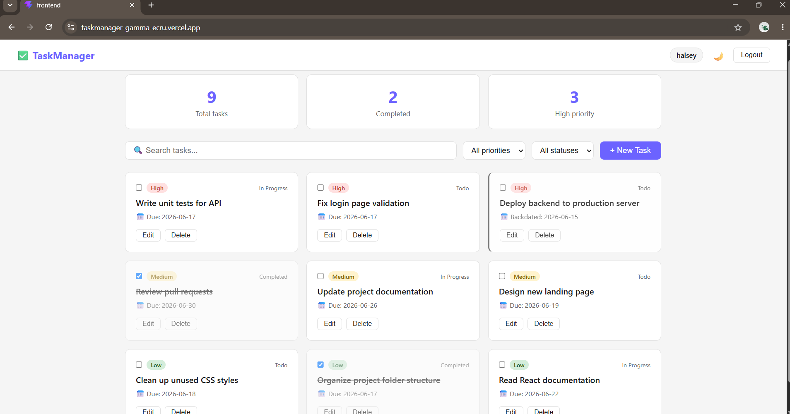
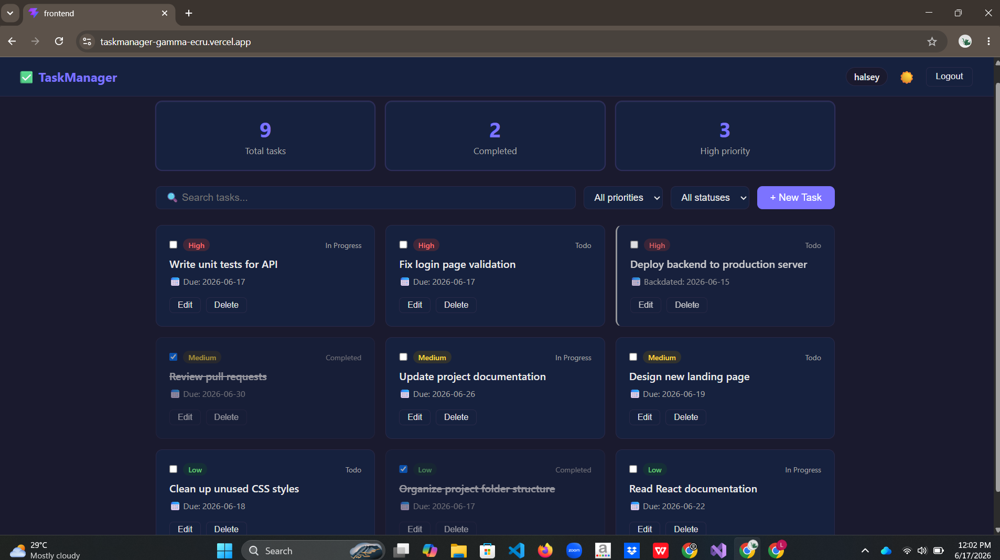
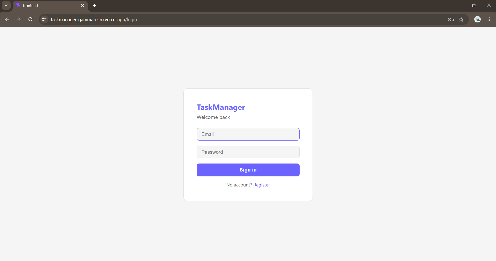
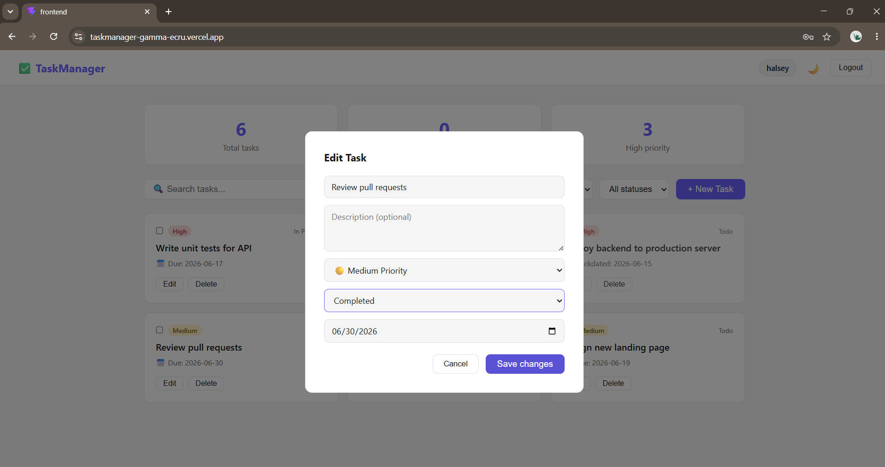

# ✅ TaskManager

A full-stack task management web application built with React, Node.js, Express, and MySQL. Features JWT-based authentication, priority-based task organization, dark mode, browser notifications, and a clean responsive UI.

---

## 🖥️ Screenshots

| Light Mode | Dark Mode |
|------------|-----------|
|  |  |

| Login | New Task |
|-------|----------|
|  |  |

---

## 🚀 Features

- **JWT Authentication** — secure register and login with 7-day token expiry
- **Task Management** — create, edit, delete tasks with title, description, priority, due date, and status
- **Priority System** — High / Medium / Low with color-coded badges
- **Status Tracking** — Todo, In Progress, Completed with checkbox toggle
- **Search & Filter** — filter tasks by priority and status, search by title
- **Overdue Detection** — tasks past their due date are highlighted automatically
- **Dark Mode** — full dark/light theme toggle
- **Browser Notifications** — native notifications for tasks due today and tomorrow
- **Toast Feedback** — instant success/error feedback on every action
- **Stats Dashboard** — live count of total, completed, and high priority tasks
- **Rate Limiting** — brute force protection on auth routes (10 requests / 15 min)

---

## 🛠️ Tech Stack

**Frontend**
- React 18 (Vite)
- React Router v6
- Axios
- react-hot-toast
- Web Notifications API

**Backend**
- Node.js
- Express.js
- MySQL2
- JSON Web Tokens (JWT)
- bcryptjs
- express-rate-limit

**Database**
- MySQL

---

## 📁 Project Structure

```
taskmanager/
├── backend/
│   ├── config/
│   │   └── db.js
│   ├── controllers/
│   │   ├── authController.js
│   │   └── taskController.js
│   ├── middleware/
│   │   └── auth.js
│   ├── routes/
│   │   ├── authRoutes.js
│   │   └── taskRoutes.js
│   ├── .env.example
│   └── server.js
└── frontend/
    └── src/
        ├── components/
        │   ├── Navbar.jsx
        │   ├── TaskCard.jsx
        │   └── TaskForm.jsx
        ├── context/
        │   └── AuthContext.jsx
        ├── pages/
        │   ├── Login.jsx
        │   ├── Register.jsx
        │   └── Dashboard.jsx
        ├── services/
        │   └── api.js
        ├── utils/
        │   └── notifications.js
        ├── App.jsx
        └── index.css
```

---

## ⚙️ Setup & Installation

### Prerequisites
- Node.js v18+
- MySQL

### 1. Clone the repository
```bash
git clone https://github.com/THULANI003/taskmanager.git
cd taskmanager
```

### 2. Set up the database

Open MySQL and run:
```sql
CREATE DATABASE taskmanager;
USE taskmanager;

CREATE TABLE users (
  id INT AUTO_INCREMENT PRIMARY KEY,
  name VARCHAR(100),
  email VARCHAR(100) UNIQUE NOT NULL,
  password VARCHAR(255) NOT NULL,
  created_at TIMESTAMP DEFAULT CURRENT_TIMESTAMP
);

CREATE TABLE tasks (
  id INT AUTO_INCREMENT PRIMARY KEY,
  user_id INT NOT NULL,
  title VARCHAR(255) NOT NULL,
  description TEXT,
  status ENUM('todo', 'in_progress', 'completed') DEFAULT 'todo',
  priority ENUM('high', 'medium', 'low') DEFAULT 'medium',
  due_date DATE,
  created_at TIMESTAMP DEFAULT CURRENT_TIMESTAMP,
  FOREIGN KEY (user_id) REFERENCES users(id) ON DELETE CASCADE
);
```

### 3. Configure backend environment

```bash
cd backend
cp .env.example .env
```

Edit `.env` with your values:
```env
DB_HOST=localhost
DB_USER=root
DB_PASSWORD=your_mysql_password
DB_NAME=taskmanager
JWT_SECRET=your_secret_key
PORT=5000
```

### 4. Install and run the backend
```bash
cd backend
npm install
node server.js
```

### 5. Install and run the frontend
```bash
cd frontend
npm install
npm run dev
```

Open [http://localhost:5173](http://localhost:5173)

---

## 🔌 API Endpoints

### Auth
| Method | Endpoint | Description |
|--------|----------|-------------|
| POST | `/api/auth/register` | Register new user |
| POST | `/api/auth/login` | Login and receive JWT |

### Tasks (all require Authorization header)
| Method | Endpoint | Description |
|--------|----------|-------------|
| GET | `/api/tasks` | Get all tasks (supports ?search, ?priority, ?status) |
| POST | `/api/tasks` | Create a new task |
| PUT | `/api/tasks/:id` | Update a task |
| DELETE | `/api/tasks/:id` | Delete a task |
| PATCH | `/api/tasks/:id/status` | Toggle task status |

---

## 👤 Author

Thulani Ransadi
GitHub: [@THULANI003](https://github.com/THULANI003)